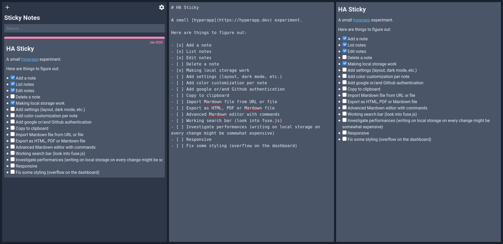

# HA Sticky

A small [hyperapp](https://hyperapp.dev) experiment.

Here are things to figure out:

-   [x] Add a note
-   [x] List notes
-   [x] Edit notes
-   [ ] Delete a note
-   [x] Making local storage work
-   [ ] Add settings (layout, dark mode, etc.)
-   [ ] Add color customization per note
-   [ ] Add google or/and Github authentication
-   [ ] Copy to clipboard
-   [ ] Import Mardown file from URL or file
-   [ ] Export as HTML, PDF or Mardown file
-   [ ] Advanced Mardown editor with commands
-   [ ] Working search bar (look into fuse.js)
-   [ ] Investigate performances (writing on local storage on every change might be somewhat expensive)
-   [ ] Responsive
-   [ ] Fix some styling (overflow on the dashboard)
-   [ ] Rewrite to TS
-   [ ] Better organization of files(maybe get inspired from Elm)
